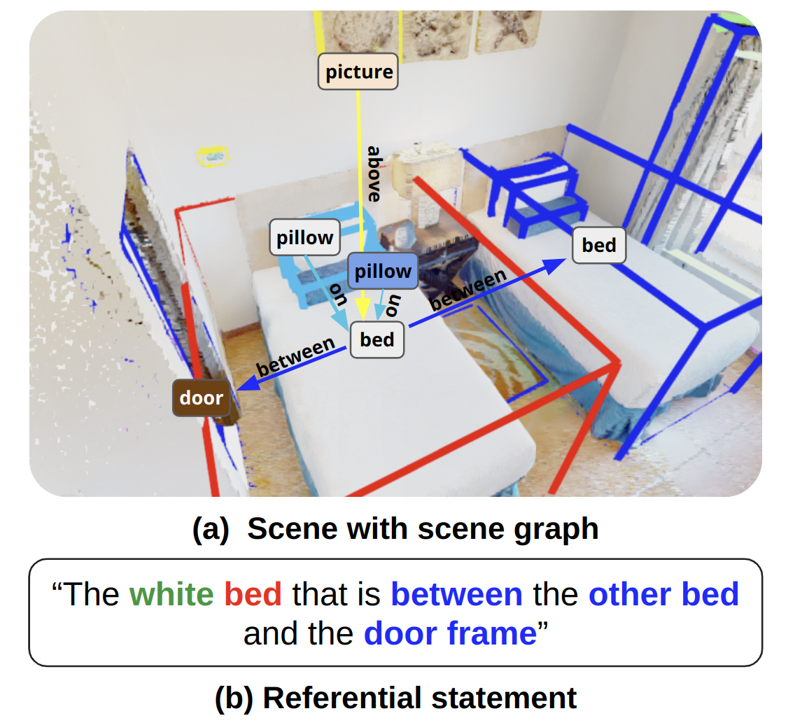

# IRef-VLA Benchmark

<div style="text-align: center; margin-bottom: 1em">
<a href="https://HaochenZ11.github.io">Haochen Zhang<sup>✶</sup></a>,
<a href="https://nzantout.github.io">Nader Zantout<sup>✶</sup></a>,
<a href="https://sites.google.com/view/pujith-kachana/">Pujith Kachana</a>,
<a href="https://frc.ri.cmu.edu/~zhangji/">Ji Zhang</a>,
<a href="http://www.wangwenshan.com/">Wenshan Wang</a>
<br>
<sup>* </sup>Equal contribution<br>
</div>

<div style="text-align: center; margin-bottom: 1em">
    <a href="https://arxiv.org/abs/2503.17406" target="_blank">
    </a>
    <a href="https://youtu.be/Qs_EUFAWR-s" target="_blank">
    </a>
</div>

The IRef-VLA dataset is a 3D object referential dataset designed for vision-language grounding that can be used for the higher-level task of vision-language navigation (VLN), as well as for navigation methods that provide feedback. This dataset consists of over 11.5K scanned 3D rooms from existing datasets, 7.6M heuristically generated spatial relations, and 4.7M referential statements. It also contains semantic object and room annotations, scene graphs, navigable free space annotations, and is augmented with statements where the language has imperfections or ambiguities. A sample scene from each data source can be found under [sample_data](sample_data/). A sample visualization of a region from the dataset is visualized with a) a scene graph and b) a corresponding referential statement in the figure below. 

This repository is set up to run training and evaluation on the IRef-VLA dataset for various baselines. It includes the dataloader for the IRef-VLA benchmark, the MVT [1] and 3D-VisTA [2] baselines for 3D grounding, along with a custom scene graph search baseline. The installation guide and the scripts to recreate the evaluations from our paper are included. More details can be found under the [Installation](#installation) section. The dataloading, training, and evaluation infrastructure are designed to be flexible and extensible, allowing for easy integration of new methods or models to compare against the established baselines.

**Note**: this benchmark is an extension on top of [VLA-3D](https://github.com/HaochenZ11/VLA-3D).

<p align="center">
 
</p>

## Updates
- [2025-01] Corresponding [paper](https://arxiv.org/abs/2503.17406) accepted to ICRA 2025!.
- [2024-10] We release the first version of our dataset. Refer to the [Dataset Download](#dataset-download) section for download instructions.


## Dataset Download

Install minio and tqdm:

```bash
pip install minio tqdm
```

Run the [data/download_dataset.py](data/download_dataset.py) script. The script can be run with the following arguments:

- `--download_path`: path to output folder where dataset is downloaded.

- `--subset`: specify name of dataset source to download only a subset of the data. One of Matterport/Scannet/HM3D/Unity/ARKitScenes/3RScan. If argument not given, the full dataset will be downloaded.

The data will be downloaded as zip files in the output directory, each corresponding to a 3D dataset source.

```bash
python download_dataset.py --download_path full_dataset
```

## Raw Data
Following a template-based synthetic language generation method similar to [ReferIt3D](https://referit3d.github.io/) [3], referential natural-language statements were generated that refer to objects in scenes from six 3D scan datasets:
- [Matterport3D](https://github.com/niessner/Matterport) [4]: 90 scenes - 2195 regions
- [ScanNet](https://github.com/ScanNet/ScanNet) [5]: 1513 scenes
- [Habitat-Matterport 3D (HM3D)](https://github.com/matterport/habitat-matterport-3dresearch) [6]: 140 scenes - 1991 regions
- [Unity](https://docs.unity3d.com/Manual/index.html) [7]: 15 scenes + 3 scenes omitted for the challenge - 46 regions
- [ARKitScenes](https://github.com/apple/ARKitScenes) [8]: 4494 scenes
- [3RScan](https://github.com/WaldJohannaU/3RScan) [9]: 1381 scenes


## Dataset Format
The overall file structure for the dataset is:
```
<dataset_folder>/
 -- <scene_name>/
    -- <scene_name>_pc_result.ply
        Processed point cloud of entire scene
    -- <scene_name>_object_split.npy
        File containing object IDs and split indices for use with the .ply file
    -- <scene_name>_region_split.npy
        File containing region IDs and split indices for use with the .ply file
    -- <scene_name>_object_result.csv
        Object information file containing object id, class labels, bounding box, and dominant colors of every object in the scene
    -- <scene_name>_region_result.csv
        Region information file containing region id, region name, bounding box
    -- <scene_name>_scene_graph.json
        Scene graph containing object relations within each region/room in the scene
    -- <scene_name>_referential_statements.json
        JSON file containing generated language statements
```

The format of the generated scene graphs are in JSON, where all objects along with their attributes and inter-object relations are stored per-region within the file for each scene. Objects attributes include semantic class labels, bounding box, size, dominant colors and heading direction (if any). 

The format of the generated language is also in JSON, where each JSON object consists of the language statement, information on the referred target object and anchor objects, relation type, distractor objects, and augmented false statements. The referred objects are stored with their object_id, class label, center point, size (volume of bounding box), and top-three dominant colors.


The table below shows the number of different types of statements with synonyms included. Note that the statement types are not necessarily mutually exclusive with each other. Closest and farthetst statement categories also include second/third closest/farthest.

| Statement Type | Total Statements | 
|----------|-------------|
| Above    | 44,820 | 
| Below    | 79,060 | 
| Closest  | 1,451,554 | 
| Farthest | 1,423,102 |
| Between  | 243,228 |  
| Near     | 1,557,805 |
| In       | 9,300 |
| On       | 28,087 |
| Mentions color | 656,491 |
| Mentions size | 2,130,448 |
| **Total** | **4,795,505** |


## Dataset Visualizer
An [Open3D](https://www.open3d.org/)-based visualization tool is provided to visualize the language statements along with the scene. Details on installing and using the visualizer can be found in [visualizer/README.md](visualizer/README.md).


## Baseline Environment Installation

We have created a single conda environment to run all baselines for convenience.

1. Create the conda environment:

    ```bash
    conda env create --name irefvla --file=environment.yml
    ```

    Note that this code has been tested on Python 3.8 with CUDA 11.8 and PyTorch 2.4. It should work normally on higher CUDA and PyTorch versions, but ensure that you install matching PyTorch and CUDA versions.

2. Install [PointNet++](https://github.com/charlesq34/pointnet2). Note that PointNet2 requires GCC with a version higher than 9, a separate CUDA toolkit installation, and PyTorch with a matching CUDA version. These are bundled with the conda environment we provide, but if errors in PointNet2 installation arise due to the system not finding CUDA and GCC (e.g. on an HPC cluster), update GCC and install CUDA locally before installation. The installation command is as follows:

    ```bash
    conda activate irefvla
    cd commons/pointnet2
    python setup.py install
    ```

    This will install PointNet++ for both MVT and 3D-VisTA.


## Running Training/Evaluation

The `scripts` folder contains bash scripts for training and evaluating the MVT and 3D-VisTA models on the IRef-VLA dataset. Set the variables in the scripts ('data_path', 'proj_name', etc) to their respective values and run the corresponding scripts.

### MVT

To train MVT on the full IRef-VLA dataset:
```bash
# Training
bash scripts/train_MVT.bash
```

To evaluate MVT the full IRef-VLA dataset:
```bash
# Evaluation
bash scripts/eval_MVT.bash
```

To run training/evaluation on a subset of IRef-VLA of on ReferIt3D data, specify the split in the corresponding scripts. The `train_split` and `test_split` arguments control what dataset splits are used. Set the `datasets` to be either `vla`, `r3d`, or `both`.


### 3D-VisTA

To train 3D-VisTA on the full IRef-VLA dataset:
```bash
# Training
bash vista/scripts/train_vista.bash
```

To evaluate 3D-VisTA on the full IRef-VLA dataset:
```bash
# Evaluation
bash vista/scripts/eval_vista.bash
```

To run training/evaluation on the ReferIt3D statements instead, add the argument `--use_sr3d` when running the python script.

### Graph-Search 
To run evaluation with the scene graph baseline, run the [graph-search/sg_baseline.py](graph-search/sg_baseline.py) script with the following arguments:

- `data_path`: path to dataset folder
- `llm_output_file`: output json from LLM parsing

Note that the LLM parsing component is run independently ahead of time to save the output results from the API and minimize API calls.

## References
[1] S. Huang, Y. Chen, J. Jia, and L. Wang, “Multi-View Transformer for 3D Visual Grounding,” 2022 IEEE/CVF Conference on Computer Vision and Pattern Recognition (CVPR), Jun. 2022, doi: https://doi.org/10.1109/cvpr52688.2022.01508.

[2] Z. Zhu, X. Ma, Y. Chen, Z. Deng, S. Huang, and Q. Li, “3D-VisTA: Pre-trained Transformer for 3D Vision and Text Alignment,” arXiv (Cornell University), Oct. 2023, doi: https://doi.org/10.1109/iccv51070.2023.00272.

[3] Achlioptas, P., et al, "Referit3d: Neural listeners for fine-grained 3d object identification in real-world scenes," in Computer Vision–ECCV 2020: 16th European Conference, Glasgow, UK, August 23–28, 2020, Proceedings, Part I 16, 2020, pp. 422–440.

[4] Chang, A., et al. "Matterport3d: Learning from rgb-d data in indoor environments," in arXiv preprint arXiv:1709.06158, 2017.

[5] Dai, A., et al, "Scannet: Richly-annotated 3d reconstructions of indoor scenes," in Proceedings of the IEEE conference on computer vision and pattern recognition, 2017, pp. 5828–5839.

[6] Ramakrishnan, S., et al. "Habitat-matterport 3d dataset (hm3d): 1000 large-scale 3d environments for embodied ai," in arXiv preprint arXiv:2109.08238, 2021.

[7] J. Haas. "A history of the unity game engine," in Diss. Worcester Polytechnic Institute, vol. 483, no. 2014, pp. 484, 2014.

[8] Baruch, G., et al. "Arkitscenes: A diverse real-world dataset for 3d indoor scene understanding using mobile rgb-d data," in arXiv preprint arXiv:2111.08897, 2021.

[9] Johanna Wald, Helisa Dhamo, Nassir Navab, and Federico Tombari. Learning 3d semantic scene graphs from 3d indoor reconstructions. In Proceedings of the IEEE/CVF Conference on Computer Vision and Pattern Recognition, pages 3961–3970, 2020.
